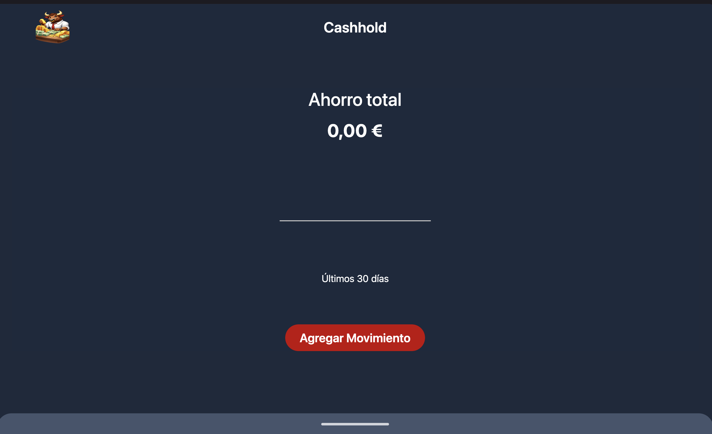
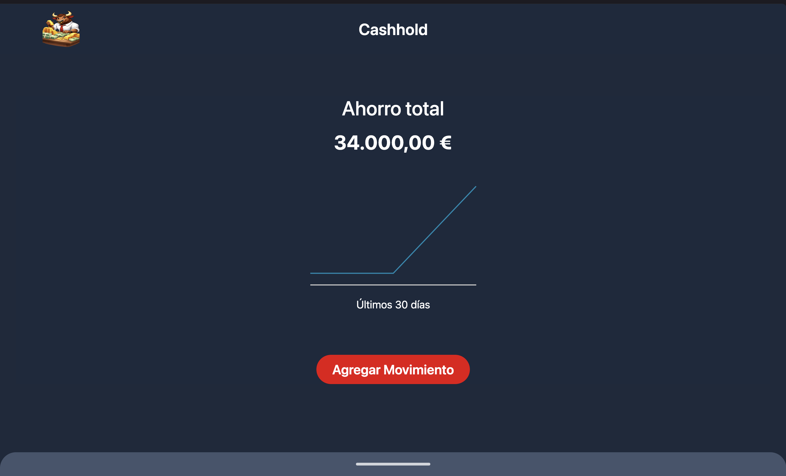
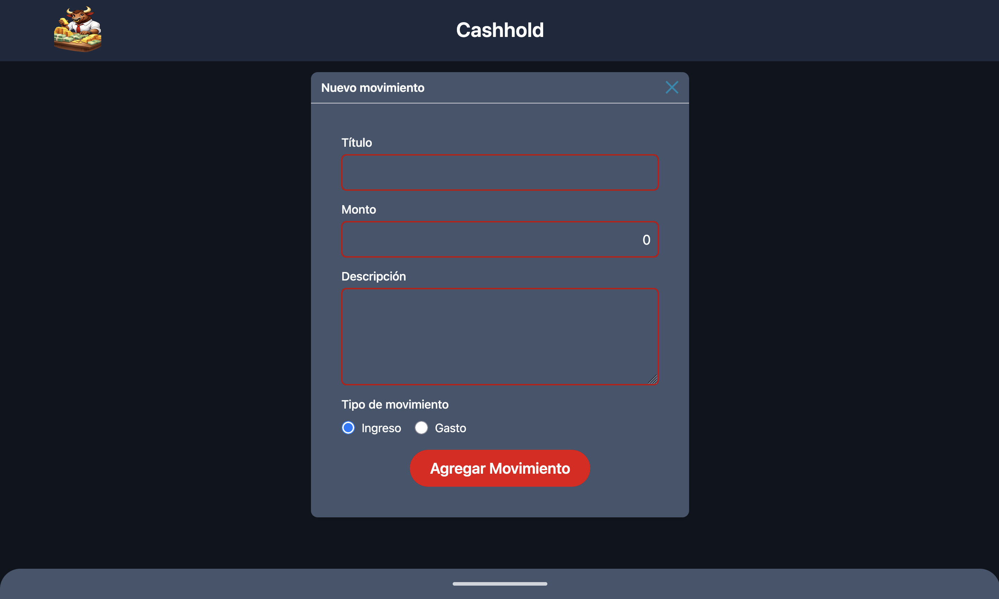

# 💰 Cashhold

Aplicación de control de gastos personales con visualización de datos en tiempo real.


## 🚀 Demo en vivo

[cashhold.netlify.app](https://cashhold.netlify.app/)

## 📸 Capturas

| Dashboard | Con datos | Nuevo movimiento |
|---|---|---|
|  |  |  |

## ✨ Características

- 📥 Registro de ingresos y egresos
- 📊 Gráficos personalizados sin librerías externas
- 💾 Balance automático actualizado en tiempo real
- 🗂️ Historial de transacciones con eliminación de movimientos
- 💿 Datos persistidos en localStorage
- ⏳ Pantalla de carga

## 🛠️ Tecnologías

| Tecnología | Uso |
|---|---|
| Vue.js 3 | Framework principal |
| Vite | Bundler y entorno de desarrollo |
| Tailwind CSS | Estilos y diseño responsive |

## 📦 Instalación

```bash
git clone https://github.com/Camilo3631/Cashhold.git
cd Cashhold
npm install
npm run dev
```

## 🏗️ Build para producción

```bash
npm run build
```

---

Desarrollado por [Camilo Acosta](https://acostaweb.es/es)
